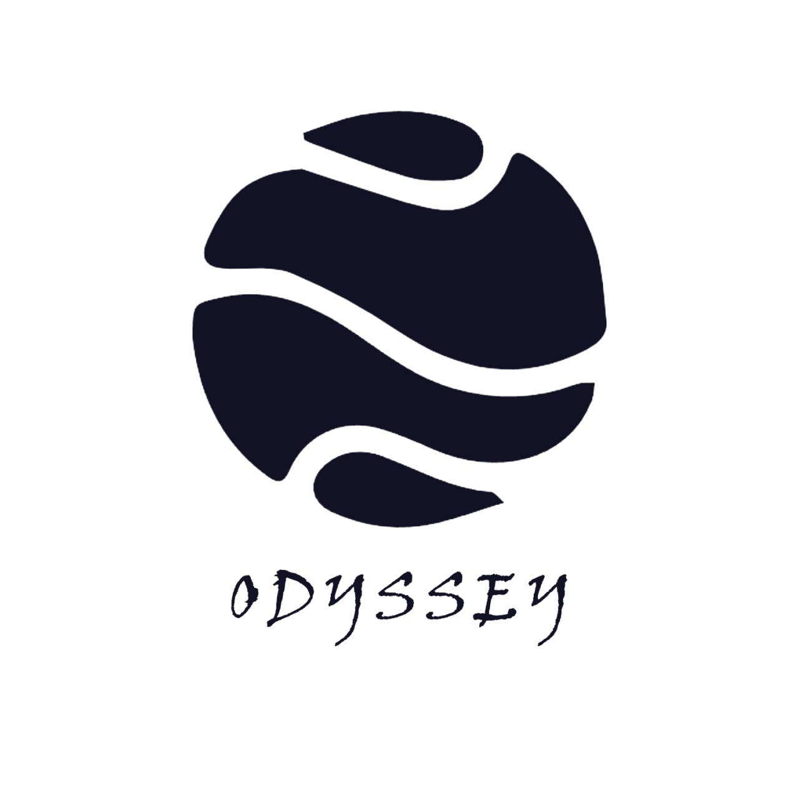

<!-- PROJECT LOGO -->
 

  

  <h3 align="center">NUS Odyssey</h3>

  

    A long and eventful journey to manage your mental health!
     
    <a href="https://www.nusodyssey.com"><strong>Explore our website »</strong></a>
     
    
    <a href="https://www.youtube.com/watch?v=Mq4iBlKHxMk&ab_channel=NUSOdyssey">View Demo</a>
    ·
    <a href="https://github.com/nus-teletubbies/makerthon-odyssey/issues">Report Bug</a>
    ·
    <a href="https://github.com/nus-teletubbies/makerthon-odyssey/issues">Request Feature</a>
  

<!-- ABOUT THE PROJECT -->
## About The Project

  

Following the theme of NUS Makerthon 2022 about mental health, Odyssey is a **web app for NUS students to strengthen their mental health and build a supportive community.** Being an anonymity sharing platform, it encourages students to share their emotions status and possible coping mechanisms while preserving their own privacy. 

Main features of the app includes:
* Providing tips for students to improve their mental health (e.g. general tips, conversation tips when seeking help, etc...)
* Providing tips for students to help those around them who are struggling
* Allowing them to contribute useful solutions to the community

In addition, the whole website uses galaxy and planet as the main theme, which aims to transform the tough process of emotional recovery to an exciting journey of space travel and treasure hunting. 

We hope you find Odyssey useful in your adventurous journey to strengthen your mental health and help others!

(<a href="#top">back to top</a>)

### Built With

This section should list any major frameworks/libraries used to bootstrap your project. Leave any add-ons/plugins for the acknowledgements section. Here are a few examples.

* [React.js](https://reactjs.org/)
* [Firebase](https://firebase.google.com/)

(<a href="#top">back to top</a>)

<!-- ROADMAP -->
## Roadmap

- [x] Add Homepage
- [x] Connect to Firebase backend to fetch data from realtime database
- [x] Enable User Sign up/ Log in
- [x] Create User Profile
- [x] Add Emotion Planets
- [x] Add Solutions to each Planet
- [x] Add "Like a solution" feature
- [x] Create "My Collection" page for user to view liked solutions
- [x] Add Relics to each Planet
- [x] Create "Leave a Relic" feature for user to contribute relic
- [x] Create "My Relics" page for user to view their relics
- [x] Create "Resources" page to list out complementary resources of the website
- [x] Add external link for each Solution
- [ ] Add feature to allow users to create their own plants
- [ ] Add feature to provide users with more specific solution based on their own profiles
- [ ] Incorporate Machine Learning to provide more accurate anaylsis of user emotion

(<a href="#top">back to top</a>)

<!-- ACKNOWLEDGMENTS -->
## Acknowledgments

* [React Icons](https://react-icons.github.io/react-icons/search)
* [Canva](https://www.canva.com/) 
* [Pexels](https://www.pexels.com/)
* [Framer Motion](https://www.framer.com/motion/)
* [Styled-components](https://styled-components.com/)

(<a href="#top">back to top</a>)

